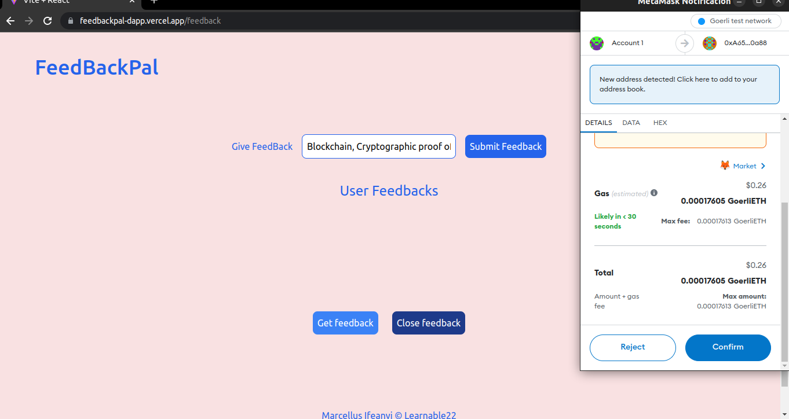

# FeedBack DApp

## Description

This is a Decentralized Application that enables people to send us feedback on what they think about us without revealing their personal details.

This is helpful for people to give us honest feedback without worrying about their reputation, since their identity will be private using blockchain, you will only be able to know their wallet address

# Live Demo Here

The Dapp is available online at:

- https://feedbackpal-dapp.vercel.app/

## Usage

- To use this Dapp use the link of the deployed Dapp, [FeedBackPal](https://feedbackpal-dapp.vercel.app/) or clone the repository and cd into the directory such that you are on `frontEnd`
- To run this code, make sure you have [nodejs](https://nodejs.org) or [yarn](https://yarnpkg.com/) installed
- use the following command to run the code on your terminal

```bash
- install the needed dependency
#yarn install

yarn install

- run the DApp locally
# yarn dev

yarn dev

```

## HomePage Views

- If the `frontEnd` is run as it is on this repository, the HomePage should look like as shown below.

The DApp is fully mobile responsible, however I recommend that you use desktop, since you will be needing Browser wallets like Metamask for you to sign the transactions (feedback or comment)

### Desktop View


### Mobile View


## Direction for Use

#### How To Give FeedBack

- When you are on the HomePage, to give feedback or comment and to view feedback, click on the "Give me FeedBack " button, this will take you to the feedback page and Prompt you to connect your Browser wallet, [MetaMask](https://metamask.io/) as show in the pictures below

### FeedbackPage view


### Wallet Connection view


- Then write your feedback inside the input text field and then click on the "Submit FeedBack" button and then Metamask will pop and ask you to "Confirm" or "Reject" transaction as show in the picture.

### Confirm Transaction view



- After confirming the transaction(giving metamask approval to submit your feedback) , then wait for few minutes for the [BlockChain Nodes](https://www.blockchain-council.org/blockchain/blockchain-nodes/) to confirm your transaction.

- After the nodes have finished confirming your transaction, then you will notification that "Transaction Completed". Then the "text input" field will change back to default.

### How To View FeedBacks

- To view current and all feedbacks stored on this contract click on the "Get feedback" button. This will display all the feedbacks stored on this contract as shown in the picture below. The feedback shows the address of the sender and the comment (feedback) from the sender

### View Feedback/s


- To close feedback, click on the "Close feedback" button

## Future Improvement

This project is subject to further improvements and addition of new features and upgrades.

- feature to show the "Timestamp", so that user can know the time and date feedback (comment ) was give to them.
- feature to allow only the owner of the deployed contract to view the feedbacks. Thus everyone can send or give feedback but only the owner of the contract will be allowed to view the feedback.

- UI features. more features will be added for the UI

- And more

## Contributing

This Project is Open for Contribution by all,
Pull requests are welcome.
For major changes, please open an issue first
to discuss what you would like to change.

### Instructions

- Fork this repository
- Clone your forked repository
- Add your scripts
- Commit and push
- Create a pull request
- Wait for pull request to merge

## Show your support

Give a ⭐️ if this project helped you!

## License

[MIT](https://choosealicense.com/licenses/mit/)
